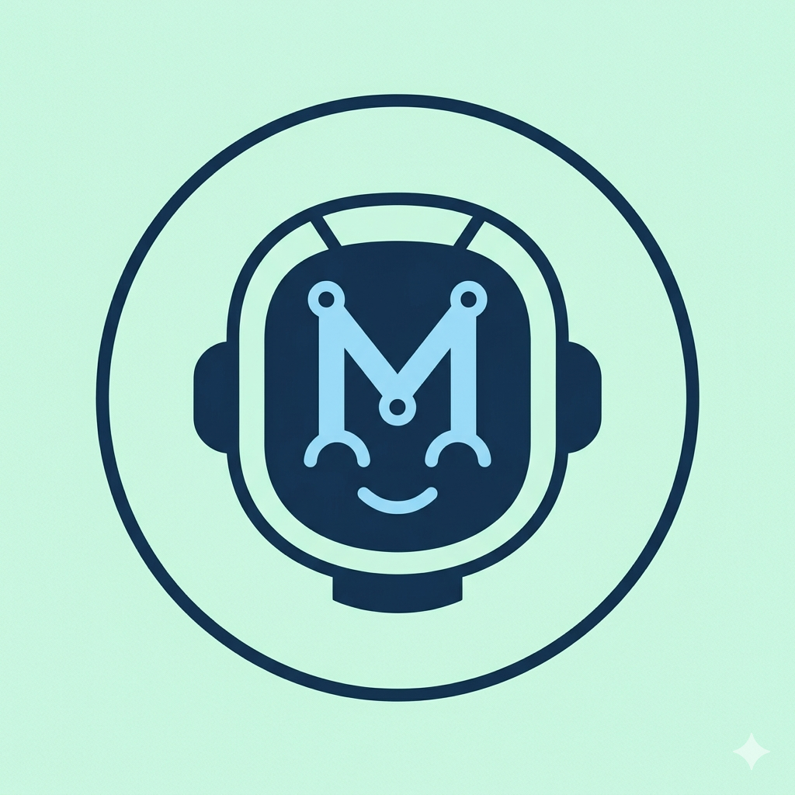

# copain — assistant Telegram personnel

<p align="center">
  
</p>

Bot Telegram mono-utilisateur en langage naturel français.
Hébergé partiellement sur Raspberry Pi 5 (services locaux) + LLM cloud.

## Capacités

- Conversation avec mémoire sémantique automatique
- Tâches + rappels Telegram en langage naturel
- Recherche web (SearXNG self-hosted, résumé FR)
- Flux RSS (ajout/liste/résumé des actus à la demande)
- Briefing matinal automatique à 8h : météo + tâches + évènements + top 5 RSS
- Analyse de photos (texte, scène, graphique, menu, reçu, etc.)
- Calendrier iCloud via CalDAV (création + listing d'évènements dans n'importe
  quel calendrier iCloud, fuzzy matching du nom)

Le routing entre ces capacités est piloté par le LLM via un bloc `<meta>` JSON
qu'il produit en fin de chaque réponse. Voir [`CLAUDE.md`](./CLAUDE.md) pour
les détails d'architecture et [`ROADMAP.md`](./ROADMAP.md) pour l'historique
des phases.

## Stack

Python 3.12 async · python-telegram-bot v21 · Ollama (`gemma4:31b-cloud` pour
le LLM multimodal, `nomic-embed-text` local pour les embeddings) · ChromaDB ·
SQLAlchemy 2 + aiosqlite · APScheduler · feedparser · caldav + vobject ·
httpx · structlog.

## Setup local (dev)

```bash
cp .env.example .env          # puis remplir les variables (voir ci-dessous)
make install                  # crée .venv, installe deps, installe pre-commit
make test                     # 59 tests, tout mocké (aucun service externe)
make lint typecheck           # ruff + mypy strict
make run                      # lance le bot (nécessite Ollama + SearXNG réels)
```

### Variables à renseigner dans `.env`

Voir [`.env.example`](./.env.example) pour la liste complète. Les indispensables :

- `TELEGRAM_BOT_TOKEN` — token du bot (via @BotFather)
- `ALLOWED_USER_ID` — ton user_id Telegram (récupérable via @userinfobot)
- `ICLOUD_USERNAME` — ton Apple ID (email de connexion)
- `ICLOUD_APP_PASSWORD` — **App-Specific Password** à générer (voir plus bas)
- `ICLOUD_CALENDAR_NAME` — nom du calendrier iCloud par défaut (matching fuzzy :
  tu peux écrire `Personnel` même si le vrai nom contient des emojis et des
  espaces autour)

Les autres variables (`TZ`, `BRIEFING_*`, `HOME_*`, `OLLAMA_*`, etc.) ont des
valeurs par défaut raisonnables et peuvent rester telles quelles pour un
usage à Sélestat.

### Créer un App-Specific Password iCloud

Obligatoire à cause du 2FA Apple ID :

1. Aller sur [appleid.apple.com](https://appleid.apple.com)
2. Connexion et sécurité → **Mots de passe pour apps** → Générer
3. Nommer l'app (ex: « copain bot »)
4. Copier le mot de passe au format `xxxx-xxxx-xxxx-xxxx` dans `.env`

## Déploiement Docker (Pi 5)

```bash
make docker-build
make docker-up
docker logs -f copain-bot-1
```

Ollama doit tourner **hors Docker** sur le Pi (pour accès GPU/NPU ARM) avec
`gemma4:31b-cloud` configuré.

Au démarrage, les logs doivent montrer :

- `startup env=...`
- `calendars_discovered count=N names=[...]`
- `calendar_connected calendar=...`
- `cron_job_scheduled job_id=daily-briefing hour=8`

## Sécurité

Le bot ignore silencieusement tout message d'un utilisateur dont l'ID ne
correspond pas à `ALLOWED_USER_ID`. Les tentatives d'accès non autorisées
sont loggées en warning.

## Documentation

- [`CLAUDE.md`](./CLAUDE.md) — architecture détaillée, conventions de code,
  system prompt, structure complète du projet
- [`ROADMAP.md`](./ROADMAP.md) — statut d'implémentation des phases (RSS,
  briefing, vision, iCloud) + historique des commits structurants
- [`.env.example`](./.env.example) — template des variables d'environnement
