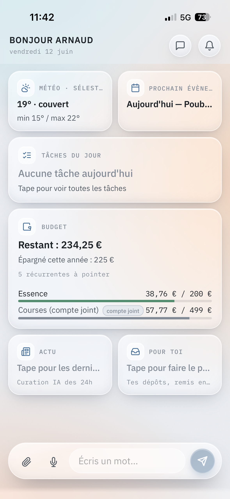

<div align="center">


# copain

### A self-hosted personal assistant designed to *absorb* mental load — not pile more on.

Talk to it in plain French — by voice, by chat, or just by walking out the door.
It remembers, plans, budgets and gently hands things back to you when they matter,
and it runs entirely on your own hardware. No cloud account, no data broker, no feed
fighting for your attention.

<br/>


<br/>

[](https://github.com/astral-sh/ruff)


<br/>

<table>
  <tr>
    <td></td>
    <td></td>
    <td></td>
  </tr>
  <tr>
    <td align="center"><sub><b>Dashboard</b> — your day at a glance</sub></td>
    <td align="center"><sub><b>Chat</b> — streamed, in plain French</sub></td>
    <td align="center"><sub><b>« Pour toi »</b> — it hands thoughts back, gently</sub></td>
  </tr>
</table>

</div>

---

## The problem it solves

A busy mind drops things: a worry you can't park, an idea you'll forget, a bill you
meant to log, an appointment that clashes with another. Most "productivity" apps answer
that by **adding** to the pile — more notifications, more badges, more inbound noise.

**copain takes the opposite stance.** Every feature has to pass one filter: *does this
get something out of the user's head, or does it add to it?* It's a **backup brain**, not
a to-do tyrant.

- 🧠 **It absorbs, it doesn't nag.** No unsolicited pushes. The dashboard is **pull-only** —
  information surfaces when you reach for it, never the other way around.
- 🗣️ **One assistant, three doors.** A PWA dashboard, a Siri voice command, and silent
  geofence automations — all served by the same FastAPI core.
- 🔒 **It's yours.** Self-hosted on a Raspberry Pi over Tailscale. Your profile, finances,
  location and calendar never leave your network — and never enter the git history.

> **In one line:** a single-user assistant — natural-language pipeline, semantic memory,
> calendar/budget/weather integrations, an installable PWA and a Pi deployment — designed,
> built and shipped solo.

---

## Highlights

<table>
<tr>
<td width="50%" valign="top">

### 🧠 Cognitive offloading, by design
Drop a parasitic thought — a worry, an idea, a note — and it's acknowledged in **1–3
words**, stored and embedded. A « **Pour toi** » card later surfaces what's worth a
second look (a worry now closeable against a past event, a rumination loop, a stale idea)
— **pulled, never pushed**.

</td>
<td width="50%" valign="top">

### 🚪 One brain, three entry points
A **PWA dashboard** (Safari "Add to Home Screen"), a **Siri** voice shortcut
(*"Dis à Copain…"*, TTS-friendly answers), and **geofence automations** that post
arrival/departure events. Same FastAPI core, transport-agnostic pipeline.

</td>
</tr>
<tr>
<td width="50%" valign="top">

### 🧭 LLM routing via a `<meta>` block
Every reply ends with a strict JSON `<meta>` block routing the request into one of **10
intents** (`task`, `event`, `expense`, `depot`, `weather`…). The code runs the side
effects; the model only decides. One model, no brittle function-calling glue.

</td>
<td width="50%" valign="top">

### 🗂️ Memory that knows you
**Semantic memory** (ChromaDB + embeddings) recalls past context, and a hand-edited
**profile** (name, family, work, routines) is injected as stable facts into every prompt —
so the assistant doesn't have to re-discover who you are on each turn.

</td>
</tr>
<tr>
<td width="50%" valign="top">

### 📆 Real-life integrations
**iCloud calendar** (CalDAV, fuzzy calendar match, overlap warnings), **budget** anchored
on your salary cycle (natural-language *or* form entry — same engine, zero drift),
**weather** that follows you (home ↔ work via geofence), RSS/news curation, fuel prices.

</td>
<td width="50%" valign="top">

### 🛡️ Private, resilient, observable
**Tailscale-only** access + shared-secret `X-API-Key`. A **local LLM fallback** when the
cloud is unreachable. Opt-in **Sentry** and **Pushover**. A TTL cache to spare the LLM.
Strictly opt-in proactivity, with five layered safeguards.

</td>
</tr>
</table>

---

## Tech stack

| Layer | Choice | Why |
|---|---|---|
| **Core** | Python 3.12 · `async`/`await` throughout · FastAPI + uvicorn | Single async HTTP core behind every entry point |
| **LLM** | Ollama — `gemma4:31b-cloud` (multimodal) + local fallback | One model, routed by a `<meta>` block; degrades gracefully |
| **Memory** | ChromaDB (HNSW) · `nomic-embed-text` embeddings | Semantic recall without a managed vector DB |
| **Data** | SQLAlchemy 2 async · aiosqlite · APScheduler | Tasks, thoughts, budget cycles, persisted reminders |
| **Integrations** | CalDAV (iCloud) · Open-Meteo · SearXNG · Pushover · Sentry | Real third-party services, real fail-soft handling |
| **Frontend** | React 18 · TypeScript · Vite · Tailwind 3 (installable PWA) | Typed, hashed assets (no manual cache-busting), HMR in dev |
| **Quality** | pytest (700+ tests, fully mocked) · Ruff · **mypy strict** · pre-commit | Typed, linted, green on every push |
| **Deploy** | Docker · Raspberry Pi 5 · Tailscale | Self-hosted, private by construction |

### Architecture

Everything flows through one pipeline: the LLM decides the **intent**, the code executes
the **side effects**, then a text reply comes back. Proactive notifications run on a
separate autonomous job — no LLM, no routing.

```text
iOS Shortcut · Siri · PWA   ──►  FastAPI core (X-API-Key)  ──►  Pipeline (transport-agnostic)
   (over Tailscale)                     │                            │
                                        │                            ├─ <meta> intent router (10 intents)
                                        │                            └─ side effects ──┐
                                        │                                              ▼
                                        ├─ Memory (ChromaDB + embeddings)   Tasks · Thoughts · Budget
                                        ├─ Calendar (CalDAV) · Weather · Search · RSS · Fuel
                                        └─ Proactivity job (autonomous, no LLM) ──► Pushover / PWA queue
```

```text
bot/
├── api.py            # FastAPI app — every endpoint behind X-API-Key
├── pipeline/         # transport-agnostic core: intent routing + side effects + streaming
├── llm/              # Ollama client, system prompt, <meta> parsing, TTL cache
├── memory/           # ChromaDB semantic memory + embeddings
├── thoughts/         # cognitive deposits + « Pour toi » restitution heuristics
├── finance/          # budget cycles, expense manager, CSV export, reminder cron
├── calendar/ weather/ search/ rss/ news/ fuel/ locations/   # real-life integrations
└── tasks/ notifications/ proactivity/                       # reminders + opt-in pushes

frontend/            # React 18 + TS + Vite + Tailwind PWA — build → frontend/dist, served by FastAPI
```

---

## Engineering decisions

The choices below are where the design effort went — the part worth a conversation.

<details>
<summary><b>Why route through a <code>&lt;meta&gt;</code> JSON block instead of function-calling?</b></summary>

<br/>

Native function-calling locks you to a specific API and degrades unpredictably across
models. By having the LLM emit a strict `<meta>` block at the **end** of a normal reply,
the routing logic stays in my code: one model, no vendor glue, and the **same pipeline**
serves voice, chat and image inputs. The block is parsed out before the user ever sees
the reply, and an invalid block fails soft rather than crashing the turn.

</details>

<details>
<summary><b>Why is the assistant strictly "pull-only", with no morning briefing?</b></summary>

<br/>

This is the product's backbone, expressed as a constraint: an assistant meant to *reduce*
mental load can't be a new source of interruptions. So spontaneous pushes are off by
default, the morning briefing was deliberately **removed**, and even the restitution card
("here's a thought worth revisiting") is fetched on tap — never pushed. Proactivity exists,
but it's opt-in and wrapped in five safeguards (time window, daily budget, per-kind
cooldown, dedup, feature flag).

</details>

<details>
<summary><b>Why one shared LLM with a local fallback instead of several cloud APIs?</b></summary>

<br/>

A personal assistant has to keep working when the network doesn't. A single cloud model
(`gemma4:31b-cloud`) handles the rich path; when it's unreachable, a small **local** model
(`gemma3:4b`) takes over so the bot still answers — fallback replies are never cached, so
quality recovers the moment the cloud is back. One provider also means one prompt to tune
and one cost to reason about.

</details>

<details>
<summary><b>Why let budget be entered <em>both</em> by chat and by form?</b></summary>

<br/>

Natural language is great for "*j'ai dépensé 12 € de café*", but a form is faster for
deliberate entry — so copain offers both. The trick: **both channels call the exact same
`ExpenseManager` methods**, so there is no second code path and no way for the two to
disagree on the budget math. The form simply skips the LLM intent step.

</details>

<details>
<summary><b>Why React + Vite for the frontend?</b></summary>

<br/>

The frontend started as native ES6 modules served straight by FastAPI (zero build step),
but the manual `?v=N` cache-busting on every internal import turned into a recurring source
of blank-screen bugs on iOS. It was migrated to **React 18 + TypeScript + Vite + Tailwind 3**
(mirroring my other project for a homogeneous stack): Vite emits **content-hashed assets**
(cache-busting for free), TypeScript catches breakage at build time, and a multi-stage Docker
build ships only `frontend/dist` — no Node in the runtime image. FastAPI serves it through a
`SPAStaticFiles` catch-all (`index.html` in `no-store`, SPA fallback). Same installable,
iOS-native-feeling PWA — just without the toolchain-free footguns.

</details>

---

## Privacy &amp; data

copain is single-user and built to keep your life on your own network:

- **Network layer** — reachable only over **Tailscale**; the public internet never sees it.
- **Auth layer** — every endpoint requires a shared-secret `X-API-Key`; anything else is a
  logged **403**.
- **Repo layer** — your **profile, finances, location history, memory store and calendar
  credentials are all gitignored** and never committed. The repo ships templates
  (`profile.example.yaml`, `.env.example`), never real data.

---

## Quality &amp; rigor

- **690+ tests** across **43 modules**, fully **mocked** — no external services, no network,
  no flakiness.
- **mypy strict** + **Ruff** (lint &amp; format) enforced via **pre-commit** and **CI**.
- `async`/`await` end to end; pure heuristics (restitution, budget math) isolated and unit-tested.

```bash
make test            # 690+ tests
make lint typecheck  # ruff + mypy strict
```

---

## Run it yourself

<details>
<summary><b>Setup, configuration &amp; deployment (click to expand)</b></summary>

<br/>

### Local (dev)

```bash
cp .env.example .env                              # fill in the variables
cp data/profile.example.yaml data/profile.yaml    # edit with your info
make install                                       # .venv + deps + pre-commit
make test                                          # 690+ tests, fully mocked
make run                                            # uvicorn (needs Ollama + SearXNG)
```

### Essential `.env` variables

See [`.env.example`](./.env.example) for the full list. The essentials:

- `API_KEY` — shared secret for `X-API-Key` (generate something random).
- `ICLOUD_USERNAME` / `ICLOUD_APP_PASSWORD` — Apple ID + an **App-Specific Password**.
- `ICLOUD_CALENDAR_NAME` — default calendar (fuzzy match: `Personnel` → `🧘 Personnel`).
- `HOME_LAT` / `HOME_LON` / `HOME_CITY` and `WORK_*` — weather + location context.
- `PUSHOVER_TOKEN` / `PUSHOVER_USER`, `SENTRY_DSN` — optional (push notifs, monitoring).

### iOS configuration

Two Shortcuts on the iPhone — see [`docs/ios-shortcuts.md`](./docs/ios-shortcuts.md):

1. **"Dis à Copain"** — Siri voice shortcut for hands-free interaction.
2. **Geofence automations** — 4 silent automations posting to `/event/location`.

The PWA needs no setup: open `https://<pi-tailscale-host>:8000/` in Safari and
"Add to Home Screen".

> **Cutover note (React migration).** After first deploying the React build in place of the
> old vanilla PWA, iOS may keep a stale cached shell. `index.html` is served `no-store` and
> assets are content-hashed, so a reload usually suffices — but if the home-screen app stays
> blank or shows the old UI, **delete the installed PWA and re-add it to the Home Screen once**.
> Redeploying the Pi is a normal `make docker-build && make docker-up` (the build stage runs
> `npm ci && npm run build` and bakes `frontend/dist` into the image).

### Docker (Raspberry Pi 5)

```bash
make docker-build
make docker-up
docker logs -f copain-bot-1
```

Ollama runs **outside** Docker on the Pi (for ARM GPU/NPU access); the container uses
`network_mode: host` and reaches Ollama on `localhost:11434`.

</details>

---

## Documentation

- [`CLAUDE.md`](./CLAUDE.md) — detailed architecture, conventions, system-prompt structure, full tree.
- [`docs/ios-shortcuts.md`](./docs/ios-shortcuts.md) — Siri voice command + geofence automations.
- [`.env.example`](./.env.example) — environment variable template.

---

## About

This project is the kind of work I enjoy most: owning a product end to end, from the
natural-language pipeline to a polished iOS PWA — with a strong opinion on *what it should
refuse to do*. **Always happy to talk shop** about local LLMs, assistant design, or
self-hosted, privacy-first products.

📫 Find me on my **[GitHub profile](https://github.com/arnaudstdr)**.
